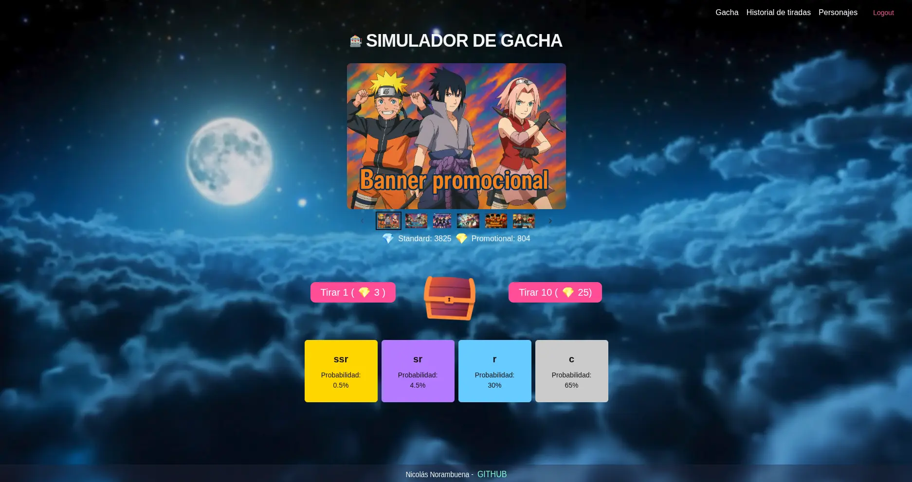

<h1 align="center">🎴 Gacha Simulator</h1>

<div align="center">
  
</div>

<p align="center">
  Simulador de sistema gacha con personajes de anime, probabilidades por rareza y gestión de créditos en tiempo real.
</p>

<p align="center">
  <a href="#acerca-de">Acerca de</a> •
  <a href="#características">Características</a> •
  <a href="#stack-tecnológico">Stack Tecnológico</a> •
  <a href="#despliegue-local">Despliegue Local</a> •
  <a href="#previsualización">Previsualización</a>
</p>

---

## Acerca de

Simulador de gacha inspirado en juegos de anime, con personajes de series como **Naruto** y **Jujutsu Kaisen**.
El sistema replica mecánicas reales de gacha: probabilidades variables según rareza, historial de pulls y
colección de personajes obtenidos. El backend incluye un **seed base** para facilitar el despliegue inicial con datos de prueba.

---

## Características

- 🎲 **Sistema de pulls** con probabilidades variables según la rareza del personaje
- ⚡ **Créditos en tiempo real** vía WebSocket — se incrementan automáticamente cada minuto
- 📋 **Registro de pulls** para revisar el historial de resultados del gacha
- 🃏 **Colección de personajes** — visualiza las cartas obtenidas y las que faltan por conseguir
- 🔐 **Panel de administrador** con gestión de roles y permisos por módulo
- 🐳 **Backend completamente dockerizado** con Docker Compose listo para usar

---

## Stack Tecnológico

| Capa            | Tecnología              |
| --------------- | ----------------------- |
| Frontend        | React + TypeScript      |
| Backend         | NestJS                  |
| Tiempo real     | WebSockets              |
| Infraestructura | Docker + Docker Compose |
| UI Components   | Chakra UI               |
| Estado global   | Redux Toolkit           |

---

## Despliegue Local

### Prerrequisitos

- Docker y Docker Compose instalados
- Node.js 18+

### Pasos

1. Clona el repositorio

```bash
git clone https://github.com/tu-usuario/gacha-simulator.git
cd gacha-simulator
```

2. Configurar la variable de entorno basado en el env.example

3. Levanta el backend con Docker

```bash
cd backend
docker compose up -d
```

4. Instala dependencia del frontend y levantalo

```bash
cd frontend
npm install
npm run dev
```

> El backend incluye un **seed base** que carga automáticamente los animes, personajes y configuración inicial. Se ejecuta con:
> `npm run seed`

---

## Previsualización

<div align="center">
  
</div>

<div align="center">
  
</div>
